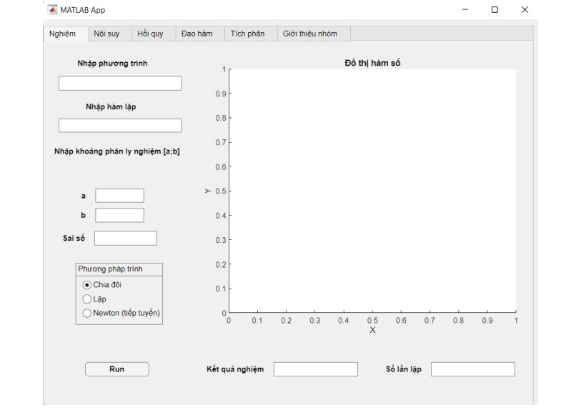

# Build a GUI to calculate calculation method problems

### Describe

- This project has implemented an interface where the user can enter an expression and then the system will automatically return the shortened result.

### GUI interface

**Apply to calculations [results]()**
